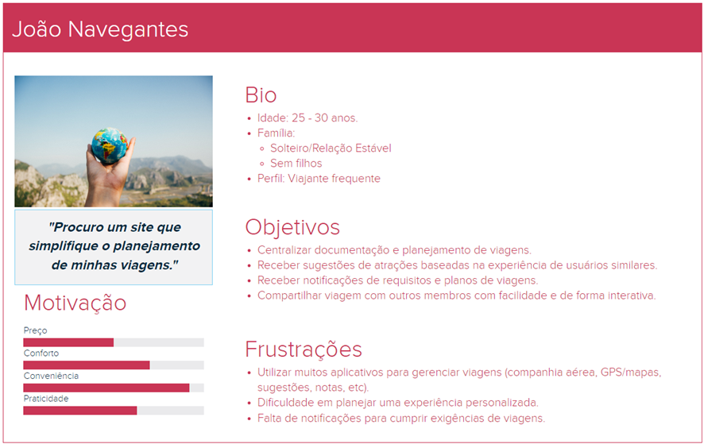

<h1 align="center">FLYING HIGH</h1>

## Sobre o projeto

<b>FlyingHigh</b> é um aplicativo desenvolvido para plataformas mobile com o intuito de auxiliar no planejamento e gerenciamento de viagens pessoais. 
Permite que usuários definam roteiros, incluindo coordenadas (com visualização em mapa) e avaliação de locais visitados. Pode também sugerir opções da
redondeza baseado na localização do usuário, tempo disponível e também avaliações de outros usuários. Possibilita também a definição de requisitos para
a viagem (como por exemplo documentação, vacinação e etc) com possibilidade de alertas, além da criação de “to-do lists” para cada dias, garantindo um 
total aproveitamento e organização de sua próxima viagem. 

## Indice/Sumário

## Requisitos Funcionais

*<b>RF01 – Cadastro de usuários: </b>Usuários podem criar uma conta na aplicação.

*<b>RF02 – Cadastro de viagens: </b>Usuários podem cadastrar viagens no aplicativo, incluindo prazos e informações de voos.

*<b>RF03 – Cadastramento de requisitos de viagem: </b>Usuários podem cadastrar requisitos para uma viagem, além de definir prazos para receber alertas e notificações.

*<b>RF04 – Cadastramento de roteiros e to-dos: </b>Permite que o usuário defina o roteiro e itinerário da viagem, como passeios, locais, restaurantes, e opções de locomoção.

*<b>RF05 – Compartilhamento de viagem: </b>Usuários devem poder compartilhar a viagem com outros participantes.
## Requisitos Não Funcionais

*<b>RNF01 – Desempenho: </b>Garantir baixa latência na execução de comandos e atualizações de estado.

*<b>RNF02 – Escalabilidade: </b>Capaz de lidar com um número crescente de usuários e dispositivos.

*<b>RNF03 – Segurança: </b>Implementar medidas robustas de segurança para dados de usuários e controle de dispositivos.

*<b>RNF04 – Usabilidade: </b>Interface amigável para facilitar o uso, especialmente para usuários não técnicos.

*<b>RNF05 – Disponibilidade: </b>O aplicativo deve ser compatível com iOS e Android, e disponibilizado nas App Stores oficiais.

## Persona

## Cenários

## Protótipos

## Tecnologias Usadas

## Contribuição

## Autores

## Licença

## Agradecimentos