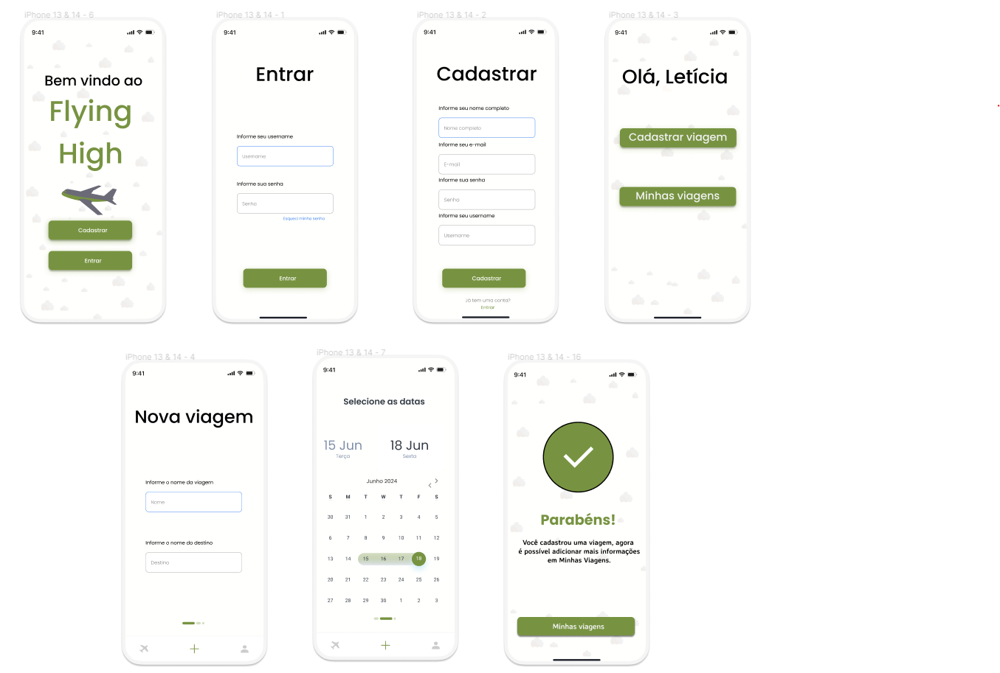

<h1 align="center">FLYING HIGH</h1>

## Sobre o projeto

<i>FlyingHigh</i> é um aplicativo desenvolvido para plataformas mobile com o intuito de auxiliar no planejamento e gerenciamento de viagens pessoais. Permite que usuários definam roteiros e <i>"to-do lists"</i> para cada dia, garantindo um total aproveitamento e organização de sua próxima viagem. Permite ainda o compartilhamento das informações com acompanhantes.

## Sumário
* [Sobre o projeto](#Sobre-o-projeto)
* [Requisitos Funcionais](#Requisitos-Funcionais)
* [Requisitos Não Funcionais](#Requisitos-Não-Funcionais)
* [Persona](#Persona)
* [Cenários](#Cenários)
* [Tecnologias Usadas](#Tecnologias-Usadas)

## Requisitos Funcionais

<b>RF01 – Cadastro de usuários:</b> Usuários podem criar uma conta na aplicação.

<b>RF02 – Cadastro de viagens:</b> Usuários podem cadastrar viagens no aplicativo.

<b>RF03 – Cadastramento de roteiros e "to do list":</b> Permite que o usuário defina o roteiro e itinerário da viagem, como passeios, locais, restaurantes, etc.

<b>RF04 – Compartilhamento de viagem:</b> Usuários devem poder compartilhar a viagem com outros participantes.

## Requisitos Não Funcionais

<b>RNF01 – Desempenho: </b>Garantir baixa latência na execução de comandos e atualizações de estado.

<b>RNF02 – Escalabilidade: </b>Capaz de lidar com um número crescente de usuários e dispositivos.

<b>RNF03 – Segurança: </b>Implementar medidas robustas de segurança para dados de usuários e controle de dispositivos.

<b>RNF04 – Usabilidade: </b>Interface amigável para facilitar o uso, especialmente para usuários não técnicos.

<b>RNF05 – Disponibilidade: </b>O aplicativo deve ser compatível com iOS e Android, e disponibilizado nas App Stores oficiais.

## Persona

## Cenários

* <b> Cadastro de Usuários: </b>João gostaria de iniciar a utilizar o <i>FlyingHigh</i> para simplificar suas viagens.
1. Em seu smartphone, João pesquisa pelo aplicativo na app store. 
2. Inicia o download da aplicação.
3. Após o download, abre o aplicativo e preenche o formulário de cadastro.

* <b>Cadastro de Viagens: </b>João gostaria de cadastrar sua primeira viagem no app.
1. João acessa a ferramenta.
2. Clica em <i>Cadastrar viagem </i>.
3. Preenche os dados básicos como duração, origem, partida, e datas.
4. Salva a viagem.

* <b>Cadastramento de Roteiros e "to do list": </b>João gostaria de começar a planejar sua viagem
1. João acessa a ferramenta.
2. Clica em <i>Minhas viagens</i>.
3. Seleciona a viagem desejada. 
4. Clica em <i>Criar roteiro</i>.
5. Seleciona a data, horário e dados da tarefa.
6. Salva alterações.
5. No menu anterior, seleciona a opção <i>Criar to do list</i> .
6. Define uma to-do list para a viagem.

* <b>Compartilhamento de Viagem: </b>Com a viagem planejada, João gostaria de compartilhá-la com sua parceira, Maria Caminho. 
1. João acessa a ferramenta.
2. Clica em <i> Minhas viagens</i>.
3. Seleciona a viagem desejada.
4. Clica em <i> Compartilhar viagem</i>.
5. Preenche o email do acompanhante. 
6. Clica em <i>Compartilhar</i>.

## Protótipos

### PROTÓTIPO LO-FI

### PROTÓTIPO HI-FI

## Avaliação (Heurísticas de Nielsen)

| Área | Avaliação | Nota |
| --- | --- |  --- |
| Visibilidade do status do sistema | O sistema implementa boas práticas para manter os usuários informados sobre o andamento dos processos, com botões de ações visíveis e acessíveis em diversas telas. Como melhoria, seria possível implementar barras de progresso nas telas de cadastro, para que o usuário compreenda o andamento do processo. | 1 - Problema Cosmético |
| Correspondência entre o sistema e o mundo real | O sistema apresenta linguagem simples, obhetiva e direta. | 0 - Não Concordância |
| Controle e liberdade do usuário | Atualmente é comum dispositivos mobile não possuiírem um botão físico para voltar, e o sistema atualmente não apresenta botão de voltar nas telas. | 3 - Problema Grande | 
| Consistência e padrões | O sistema utiliza linguagem, botões e sistema de cores padronizados. | 0 - Não Concordância | 
| Prevenção de erros | Por não incluir a implementação técnica, este ponto ainda não é 100% avaliável. Por possuir muitos campos de entrada de dados, será muito importante que a aplicação tenha um sistema tratamento de dados robusto. | 3 - Problema Grande | 
| Reconhecimento ao invés de lembrança | Os comandos e opções dos menus possuem textos e tamanhos que proporcionam um sistema intuitivo. | 0 - Não Concordância |
| Flexibilidade e eficiência de uso | O sistema atualmente não possibilita um alto nível de customização. Isto não impede a usabilidade do sistema, porém limita os tipoas de interação e fluxos possíveis. | 1 - Problema Pequeno |
| Estética e design minimalista | O sistema apresenta uma interface simples e direta, proporcionando facilidade no manuseio. | 0 - Não Concordância |
| Ajude os usuários a reconhecer, diagnosticar e recuperar erros | Por não incluir a implementação técnica, os protótipos atualmente não incluem mensagens de erro. | 3 - Problema Grande | 
| Ajuda e documentação | A documentação do aplicativo não está completa. Porém, a documentação dos Cenários auxiliam na aprendizagem do sistema. | 2 - Problema Pequeno |

## Autores

Letícia Dadalt

